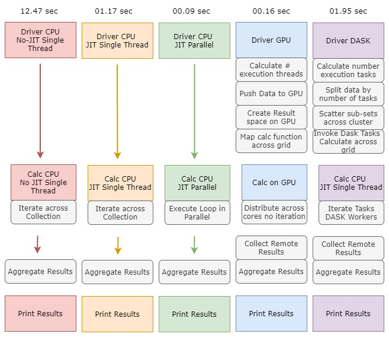

# Execution Environment

## Docker
You can run these from the stock Anaconda 3 docker container.  Numba is already installed.  
Use their instructions or _docker-compose up_ using this [docker-scripts](https://github.com/freemansoft/docker-scripts) repository.
A guide can also be found [on my blog](http://joe.blog.freemansoft.com/2020/01/dask-so-cool-faster-data-analytics-with.html).

*Note* GPU drivers are not available as pass through when running containers on Windows 10 systems (as of 3/2020)

## Linux install.
Install linux using the anaconda 3 instructions on the anaconda web site.  You can also look [on by blog](http://joe.blog.freemansoft.com/2020/03/installing-cuda-python-numba-ubuntu.html) for links and linux instructions.

# cuda-demo and dask-demo numbers
These numbers represent the amount of time it takes to iterate 10,000,000 times using various approaches

## Program Structure
The various approaches are structured as similar as possible without walking away from implementation specific optimizations.

## Algorithm
* 10,000,000 long vector [[a,b,c],[a,b,c],...]
* Calculate `math.log(param_triple[0])*math.log(param_triple[1])*math.log(param_triple[2])`
* Sum the results of all operations

## Test Machine
* Z820 2X E5-2640 v2 @ 2.00GHz 128GB memory
* 2 - 8 Core Hyper threaded
* 32 Virtual Cores
* Nvidia RTX 2060 Super

### Sample times
cuda-demo.py
```
GPU grid:            0.1630   Iterations: 10,000,000  dtype= float64 numcalc: sum( 10,000,000 ): 34986983045.74297
CPU jit parallel:    0.0922   Iterations: 10,000,000  dtype= float64 numcalc: sum( 10,000,000 ): 34986983045.74297
CPU jit serial:      1.1733   Iterations: 10,000,000  dtype= float64 numcalc: sum( 10,000,000 ): 34986983045.74297
CPU serial nojit:    12.4751  Iterations: 10,000,000  dtype= float64 numcalc: sum( 10,000,000 ): 34986983045.74297
```
dask-demo.py
```
DASK jit thrd multi   2.5249   Iterations: 10,000,000  dtype= float64 numcalc: sum( 10,000,000 ): 34986983045.74297
DASK jit thrd sing:   1.7951   Iterations: 10,000,000  dtype= float64 numcalc: sum( 10,000,000 ): 34986983045.74297
DASK jit proc mult:   1.9432   Iterations: 10,000,000  dtype= float64 numcalc: sum( 10,000,000 ): 34986983045.74297
DASK jit proc sing:   3.8063   Iterations: 10,000,000  dtype= float64 numcalc: sum( 10,000,000 ): 34986983045.74297

CPU jit parallel:     0.0922   Iterations: 10,000,000  dtype= float64 numcalc: sum( 10,000,000 ): 34986983045.74297
CPU jit serial:       1.1381   Iterations: 10,000,000  dtype= float64 numcalc: sum( 10,000,000 ): 34986983045.74297
CPU nojit serial:     10.7825  Iterations: 10,000,000  dtype= float64 numcalc: sum( 10,000,000 ): 34986983045.74297
```
### DASK threading
* Multi-threaded: 8 processors 32 threads
* Single-threaded: 1 processor 1 thread

## Test Machine
Dell Latitude I5-4310U @ 2.00Ghz / 2.60Ghz Docker 2 cores 4GB

### Sample times
dask-demo.py
```
DASK thrd multi: 1.6286  Iterations: 10,000,000  dtype= float64 numcalc: sum( 10,000,000 ): 34986983045.74297
DASK thrd sing:  1.2028  Iterations: 10,000,000  dtype= float64 numcalc: sum( 10,000,000 ): 34986983045.74297
DASK proc mult:  3.0543  Iterations: 10,000,000  dtype= float64 numcalc: sum( 10,000,000 ): 34986983045.74297
DASK proc sing:  2.6753  Iterations: 10,000,000  dtype= float64 numcalc: sum( 10,000,000 ): 34986983045.74297

CPU jit parallel:  0.4176  Iterations: 10,000,000  dtype= float64 numcalc: sum( 10,000,000 ): 34986983045.74297
CPU jit serial:    0.6670  Iterations: 10,000,000  dtype= float64 numcalc: sum( 10,000,000 ): 34986983045.74297
CPU serial nojit:  13.8456  Iterations: 10,000,000  dtype= float64 numcalc: sum( 10,000,000 ): 34986983045.74297
```

### DASK threading
* Multi-threaded: 2 processors 2 threads total
* Single-threaded: 1 processor 1 thread total
